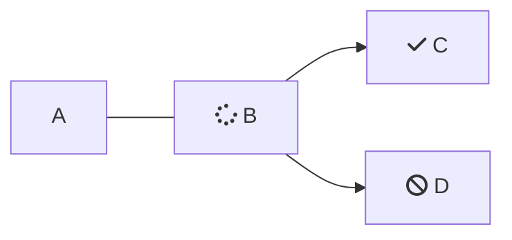

# Some 

<Cards columns={4}>
  <Card title="First Card" icon="fa-home">
    STuff
  </Card>

  <Card title="Second Card" icon="fa-user">
    Stuff
  </Card>

  <Card title="Third Card" icon="fa-star">
    stuff
  </Card>

  <Card title="Fourth Card" icon="fa-question">
    stuff
  </Card>
</Cards>

 

